# Controller Support

## macOS

|                                                                                                                  | Game                           | Store | Controller                                                                                                       | Tested     |
| ---------------------------------------------------------------------------------------------------------------- | ------------------------------ | ----- | ---------------------------------------------------------------------------------------------------------------- | ---------- |
| 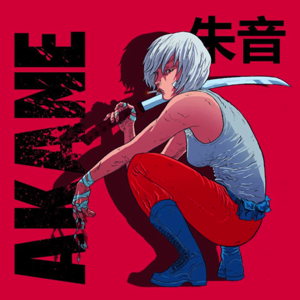                                                   | Akane                          | Steam | • DualSense ❌[BI](#bi)   • Xbox ❌[BI](#bi)                                           | 2021.12.30 |
| 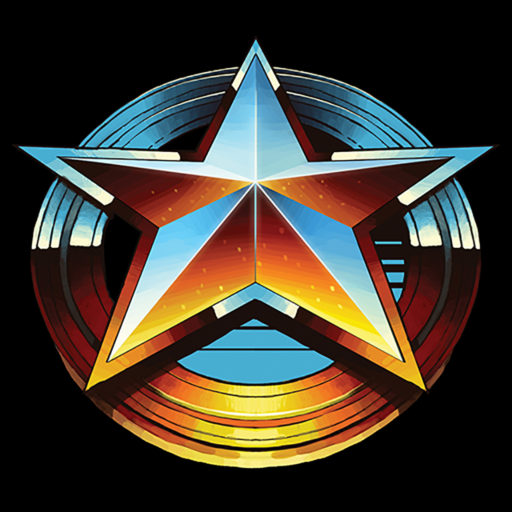                                             | Broforce                       | GOG   | • DualSense (Wireless) ✅   • Xbox ✅                                                                        | 2021.12.29 |
|                                              | Broforce                       | Steam | • DualSense (Wireless) ✅[NRSD](#nrsd)   • Xbox ❌[NR](#nr)                            | 2021.12.29 |
| 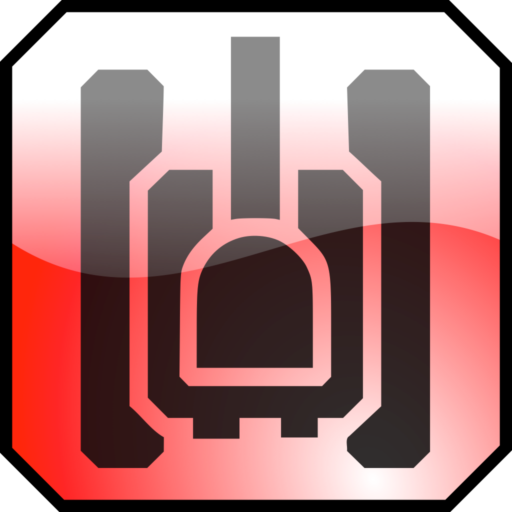                                                 | BZFlag                         |       | • Xbox 🟡[CSSD](#cssd)                                                                                | 2021.12.30 |
|                                | Castle Crashers                | Steam | • DualSense ❌[BI](#bi)   • Xbox ❌[BI](#bi) (🟡[CSSD](#cssd))              | 2021.12.30 |
| 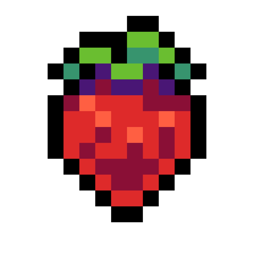                                               | Celeste                        | Steam | • DualSense (Wireless) ✅[CSE](#cse)   • Xbox ❌[NR](#nr) (🟡[CSSD](#cssd)) | 2021.12.29 |
| 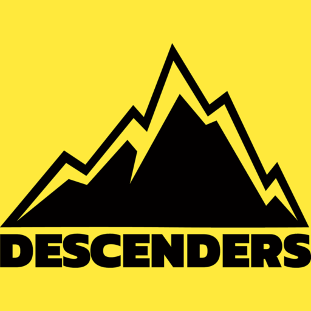                                         | Descenders                     | Steam | • DualSense (Wired) ✅[NRWL](#nrwl), [NRSE](#nrse)   • Xbox ❌[NR](#nr)                | 2021.12.30 |
| 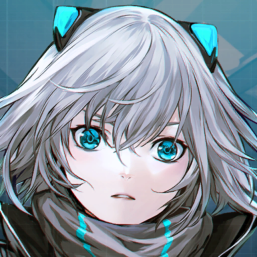                                                     | ICEY                           | Steam | • DualSense (Wireless) ✅    • Xbox ✅                                                                 | 2022.01.01 |
|                                  | The Escapist 2                 | Steam | • DualSense (Wired) ✅[NRWL](#nrwl)   • Xbox ❌[BI](#bi)                               | 2021.12.30 |
|                            | Full Metal Furies              | Steam | • DualSense (Wireless) ✅[CSE](#cse)   • Xbox ✅[NRSE](#nrse)                          | 2021.12.30 |
|  | Garfield Kart - Furious Racing | Steam | • DualSense ❌[NR](#nr)   • Xbox ✅                                                               | 2021.12.30 |
|                                    | Hollow Knight                  | GOG   | • DualSense (Wireless) ✅   • Xbox ❌[NR](#nr)                                                    | 2021.12.30 |
| 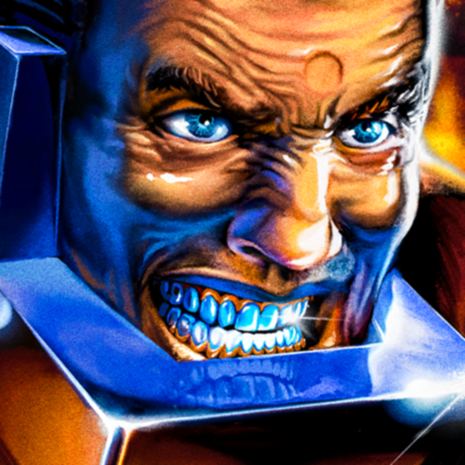                                             | HUNTDOWN                       | GOG   | • DualSense (Wireless) ✅[LG](#lg)   • Xbox ❌[BI](#bi)                                | 2021.12.29 |
|                                              | HUNTDOWN                       | Steam | • DualSense (Wireless) ✅[MCSE](#mcse)   • Xbox ❌[MCSE](#mcse), [BISD](#bisd)         | 2021.12.29 |
|                        | Just Shapes & Beats            | Steam | • DualSense (Wireless) ✅[MCSE](#mcse)   • Xbox ❌[NR](#nr)                            | 2021.12.30 |
| 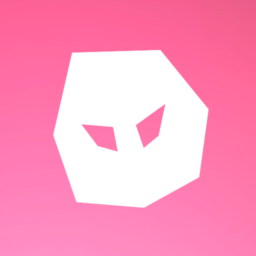                                             | MageQuit                       | Steam | • DualSense (Wireless) ✅[MCSE](#mcse)   • Xbox ❌[MCSE](#mcse), [NRSD](#nrsd)         | 2021.12.30 |
|              | Regular Human Basketball       | Steam | • DualSense ❌[NR](#nr)   • Xbox ❌[NR](#nr) (🟡[CSSD](#cssd))              | 2022.01.01 |
|                                                  | Shing!                         | Steam | • DualSense (Wired) ✅[NRWL](#nrwl)   • Xbox ✅                                                   | 2021.12.30 |
| 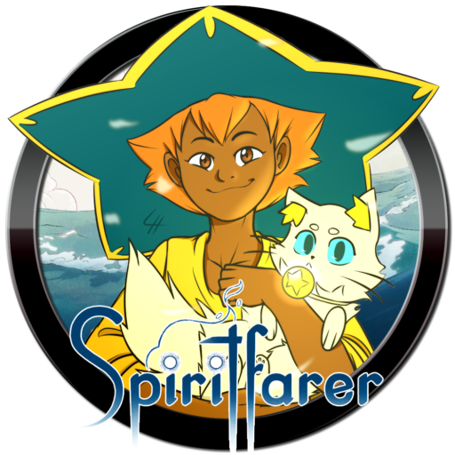                                       | Spiritfarer                    | GOG   | • DualSense (Wireless) ✅[LG](#lg)   • Xbox ❌[NR](#nr)                                      | 2021.12.29 |
|                   | Stick Fight: The Game          | Steam | • DualSense (Wireless) ❌[MCSE](#mcse), [NRSD](nrsd)   • Xbox ❌[NR](#nr)                    | 2022.01.01 |
|                            | Streets of Rage 4              | Steam | • DualSense (Wireless) ✅[NRSE](#nrse)   • Xbox ✅[NRSE](#nrse)                        | 2021.12.29 |
|                        | TowerFall Ascension            | Steam | • DualSense (Wireless) ✅[CSE](#cse)   • Xbox ❌[NRSE](#nrse)                                | 2022.01.01 |
|                                    | Tricky Towers                  | Steam | • DualSense (Wired) ✅   • Xbox ❌[NR](#nr)                                                       | 2022.01.01 |
|                  | Ultimate Chicken Horse         | Steam | • DualSense (Wired) ✅   • Xbox ❌[NR](#nr)                                                       | 2022.01.01 |
| 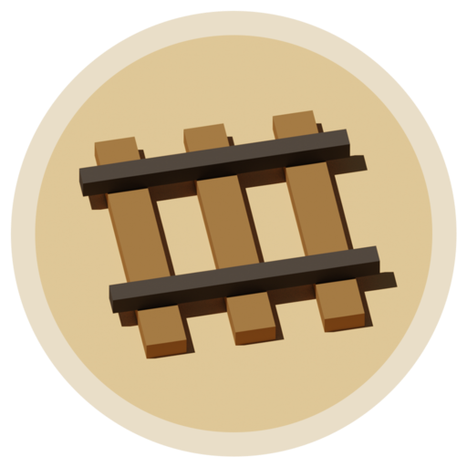                                           | Unrailed!                      | Steam | • DualSense (Wireless) ✅[NRSE](#nrse)   • Xbox ✅[NRSE](#nrse)                        | 2022.01.01 |
| 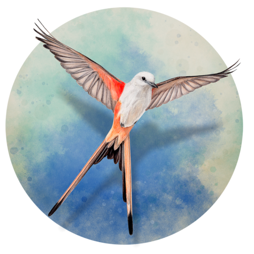                                             | Wingspan                       | Steam | • DualSense (Wireless) ✅   • Xbox ✅                                                                        | 2022.01.01 |

| Abbreviation            | Description                                                                 |
| ----------------------- | --------------------------------------------------------------------------- |
| <a name="nr">NR</a>     | Controller input **not recognized**                                         |
| <a name="nrse">NRSE</a> | Controller input **not recognized** (Steam Input Enabled)                   |
| <a name="nrsd">NRSD</a> | Controller input **not recognized** (Steam Input Disabled)                  |
| <a name="nrwl">NRWL</a> | Controller input **not recognized** (Wireless)                              |
| <a name="mcse">MCSE</a> | Controller show up as **multiple controllers** (Steam Input Enabled)        |
| <a name="bi">BI</a>     | Controller **button** layout **incorrect**                                  |
| <a name="bisd">BISD</a> | Controller **button** layout **incorrect** (Steam Input Disabled)           |
| <a name="lg">LG</a>     | Only works if **launched** through **GOG**                                  |
| <a name="cssd">CSSD</a> | Works if buttons mapped with **controller software** (Steam Input Disabled) |
| <a name="cse">CSE</a>   | **Crashes** (Steam Input Enabled)                                           |
